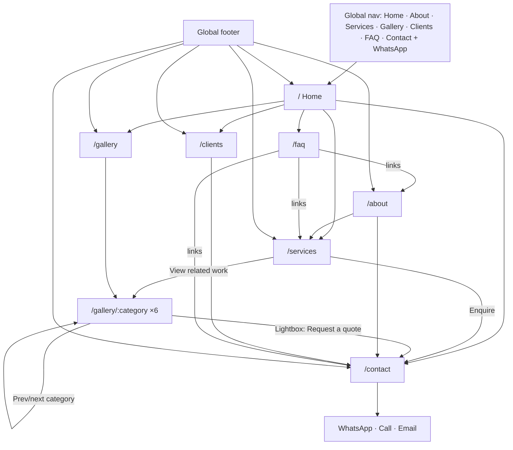

# 03 — Information Architecture / Sitemap (multi-page)

**Decision D8: multi-page site, 13 routes + 404.** (Supersedes the earlier single-page plan.)

## 1. Route map

| # | Route | Page | Replaces legacy | Primary job |
|---|-------|------|-----------------|-------------|
| 1 | `/` | Home | `index.html` | Impress, orient, route visitors deeper |
| 2 | `/about` | About | `about-us.html` | Credibility: ISO, team, facility, process |
| 3 | `/services` | Services | `services.html` | The 7 services, each linking to related work |
| 4 | `/gallery` | Gallery hub | `gallery.html` | Gateway to the 6 portfolio categories |
| 5 | `/gallery/sculptures` | Sculptures | `sculptures.html` | Browse + lightbox (77) |
| 6 | `/gallery/wall-murals` | Wall Murals | `wall_murals.html` | Browse + lightbox (35) |
| 7 | `/gallery/water-fountains` | Water Fountains | `water_fountains.html` | Browse + lightbox (18) |
| 8 | `/gallery/grc-products` | GRC Products | `grc-products.html` | Browse + lightbox (15) |
| 9 | `/gallery/planters` | Planters | `planter.html` | Browse + lightbox (4) |
| 10 | `/gallery/other` | Other Creations | `other.html` | Browse + lightbox (17) |
| 11 | `/clients` | Clients | `our_client.html` | Proof: 30 client logos |
| 12 | `/contact` | Contact | `contact-us.html` | Convert: WhatsApp / call / email / form |
| 13 | `/faq` | FAQ | — (new) | Answer common questions; reduce friction before enquiry |
| — | `*` | 404 Not found | — | Recover to Home / Gallery / Contact |

Counts are verified against real files at build time (real total 166).

## 2. Flow

## 3. Global elements (every page)
- **Header/nav:** logo → `/`, links to `/about`, `/services`, `/gallery`, `/clients`, pill CTA `/contact`; desktop quiet WhatsApp link. Active link by route (`NavLink`). On `/gallery/*` the Gallery link stays active. Mobile: full-screen menu.
- **Footer:** about blurb, quick links, contact block, ISO line, back-to-top.
- **Floating WhatsApp:** mobile only; hidden while menu/lightbox is open.
- **Route behaviour:** scroll to top on navigation, move focus to `<main>`, quiet fade between pages, unique `<title>`/description/canonical per route.

## 4. Cross-link & prefill rules
| From | To | Mechanism |
|------|----|-----------|
| Service "Enquire about this" | `/contact?service=<service-slug>` | form preselects service |
| Service "View related work" | `/gallery/<category>` | see mapping below |
| Lightbox "Request a quote" | `/contact?service=<slug>&ref=<category>-<nnn>` | prefills artwork reference |
| Category page | previous / next category | footer strip of the page |
| Hero / CtaBand | `/contact`, `/gallery` | |

Service → gallery category mapping (confirm visually before shipping):
Wall Murals → wall-murals · Water Fountains → water-fountains · Sculptures Art Installation → sculptures · Architectural Facades → grc-products · Gate Grills → grc-products · Planters → planters · Artificial Rockery → other.

Service slugs: `wall-murals`, `gate-grills`, `artificial-rockery`, `water-fountains`, `sculptures-art-installation`, `architectural-facades`, `planters`.

## 5. Legacy URL redirects (301)
`/index.html→/` · `/about-us.html→/about` · `/services.html→/services` · `/gallery.html→/gallery` · `/sculptures.html→/gallery/sculptures` · `/wall_murals.html→/gallery/wall-murals` · `/water_fountains.html→/gallery/water-fountains` · `/grc-products.html→/gallery/grc-products` · `/planter.html→/gallery/planters` · `/other.html→/gallery/other` · `/our_client.html→/clients` · `/contact-us.html→/contact`.

## 6. What lives where (so pages don't duplicate each other)
| Content | Full version | Teaser elsewhere |
|---------|--------------|------------------|
| Hero slides, intro, features | Home only | — |
| 7 services detail | `/services` | Home: names list linking to `/services` |
| Portfolio images | `/gallery/*` | Home: 6 showcase images → `/gallery`; Hub: category covers |
| Client logos | `/clients` (grid of all 30) | Home: two-row marquee |
| Process + facility + ISO | `/about` | Home: one-line ISO mention |
| FAQ (12 Q&A in 3 groups) | `/faq` | Home: 6 selected questions linking to `/faq` |
| Form + map + addresses | `/contact` | Footer: phone/email only |
